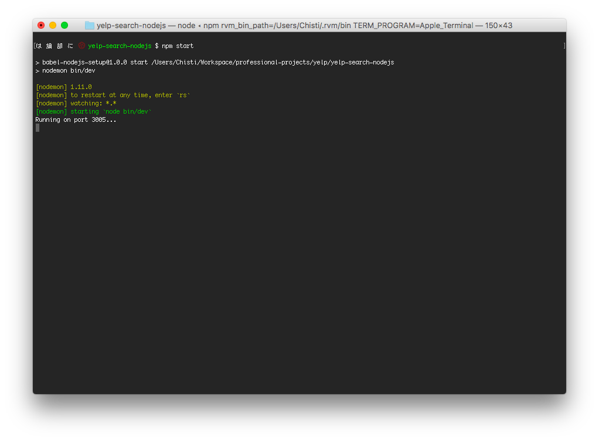

<p align="center">
  
</p>
<h3 align="center">
  WhereTo
</h3>
<p align="center" style="color: #999;">Yelp Search Client - Backend</p>

<p align="center">
  
    </br>
    This repo is the back-end for <a href="https://github.com/SeeYouSpaceCowboy/yelp-search-reactjs.git">WhereTo</a>.
</p>

## Getting Started with WhereTo
These instructions will get you a copy of the project up and running on your local machine for development and testing purposes.

### Prerequisites
Things you need to install beforehand:
* **MacOS** - This app runs on non-mac machines, but instructions need to be adjusted. 
* **npm** - Javascript package manager. (`pnpm` personally preferred)
* **nodeJs**
* **express** - nodeJs framework.

### Installing
To clone and run this backend server app. Run the following set of instructions. 
Open terminal and run the following lines of code to clone and run this project.

First clone this repo, using terminal 
 ```shell
 git clone https://github.com/SeeYouSpaceCowboy/yelp-search-nodejs.git
```
```shell
cd yelp-search-nodejs

npm i

npm start
```
 This project should now be running locally on port `3005`.

### Installing the Front-end
WhereTo consists of a front-end and a back-end. For this project to run you have to have both projects installed and running locally at the same time.

If haven't already, you should now clone and install the front-end of this project; instructions [here](https://github.com/SeeYouSpaceCowboy/yelp-search-reactjs.git).

## Built With
* [Yelp Fusion API](https://github.com/tonybadguy/yelp-fusion)
* Express
* nodeJs

## Contributors
WhereTo was built by [Mohammed Chisti](http://mohammedchisti.com).
